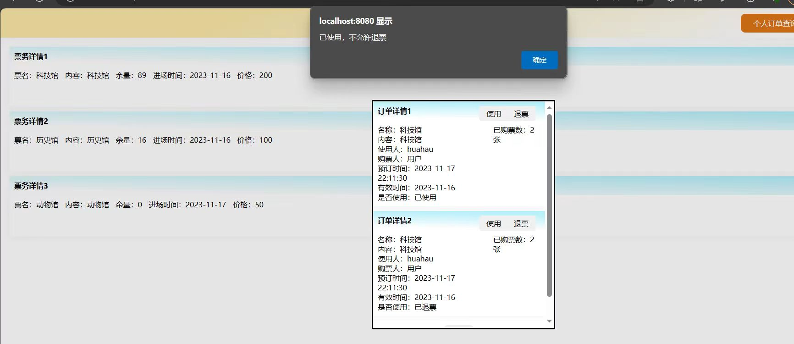

项目界面比较古老，界面可以看我录得视频

需要添加修改的功能

- 管理员查询售票数据需要一个界面，可以查询从某年某月某日到某年某月某日的售票数据，某年某月某日自由选择，售票数据需要是每种票都显示出售了多少张   **完成**
- 管理员查询营业数据需要一个界面，营业数据就只用显示一共收入了多少钱  **完成**
- 数据备份和恢复功能   **完成**
- 注册界面添加输入电话号码，注册的时候自动往数据库里name项为“用户”  **完成**
- 用户预订界面加取消按钮，预订的时候我需要所有空都不为空才能点确认，手机号必须为11位，身份证号必须为18位，对订票进行约束，当余票数为0时不可订票(数据库里也需要约束余票数大于0)， **完成**
- 展览管理需要一个功能：在对已有票进行编辑时添加一个“废弃”按钮，被废弃的票不会在用户界面出现  **完成**
- order表中需要增加两项，一项是订的票的入场时间，用的是插入时show表的show_time(进场时间）需要一个触发器（或者别的什么）使得每一天show表的入场时间都会更新成当天日期，另外order表中还要有一项总金额    **完成**
- 管理员编辑订单时不可更改门票名   **完成**
- 计算营业数据的时候改为用order表中的总金额计算  **完成**
- 数据库里state项代表否已退票，还需要一个项代表是否已使用来控制订单详情里面的是否使用，订单详情界面里否使用有三种情况：已使用，未使用，已退票  **完成**